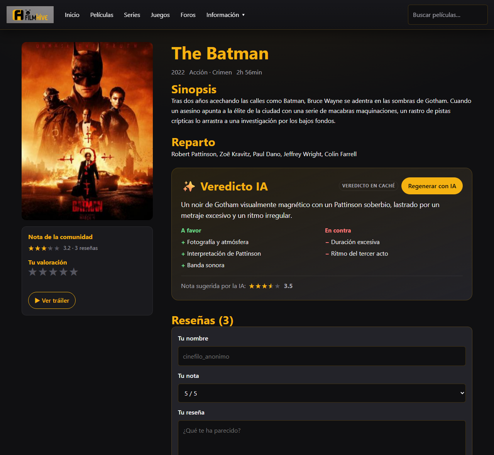
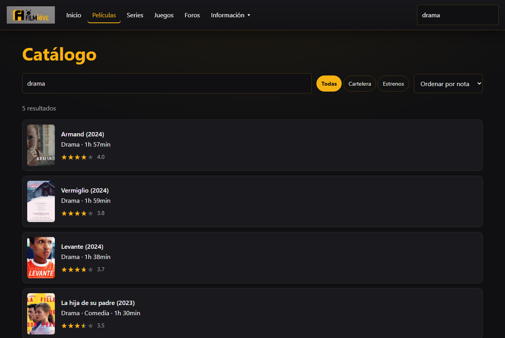
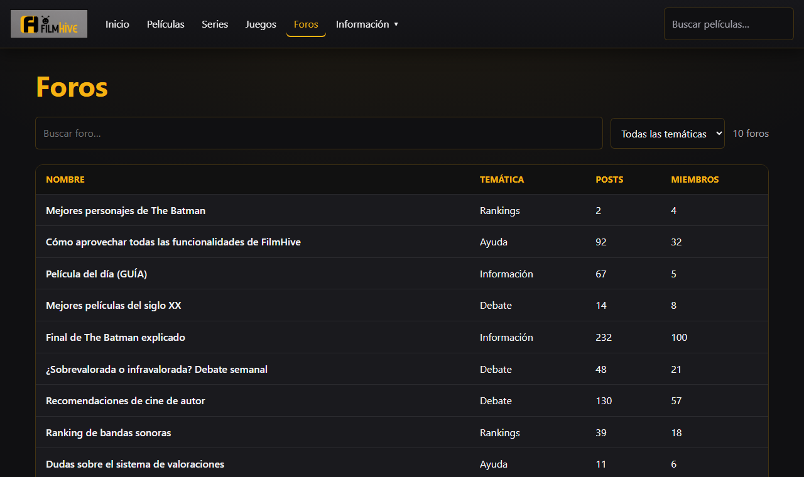
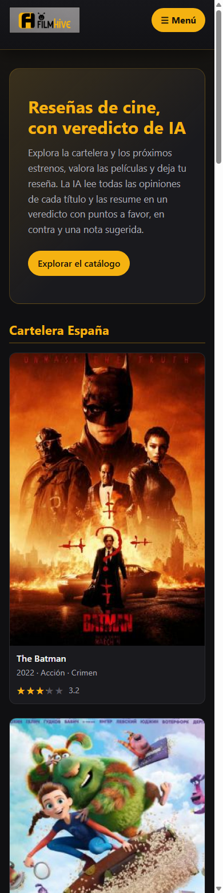

# 🎬 FilmHive

> A movie-review community with **AI-generated verdicts** — built with plain HTML, CSS and JavaScript (no framework, no build step) plus one serverless function.

FilmHive started as a university project (Web Application Design, USC) and was rebuilt from the ground up into a deployable, polished portfolio piece. Browse the catalogue, rate films and leave reviews — and let the AI read every review of a title and synthesise it into a verdict with pros, cons and a suggested score.

<!-- Replace this with your deployed URL once the site is live on Vercel -->
**▶ Live demo:** _add your Vercel URL here_ · **License:** MIT · **Stack:** Vanilla JS · Vercel Functions · Google Gemini

---

## 📸 Screenshots

| Home | Movie detail + AI Verdict |
| --- | --- |
|  |  |

| Search | Forums | Mobile |
| --- | --- | --- |
|  |  |  |

---

## ✨ Features

- **AI Verdict** — the headline feature. A serverless function sends a movie's reviews to **Google Gemini**, which returns a one-line TL;DR, recurring pros/cons and a suggested rating. It's **computed from the reviews**, so adding a review and regenerating changes the verdict. Falls back to a cached verdict when no key is configured.
- **Real search** — filter the catalogue by title, genre or synopsis, narrow by section and sort by score, year or title (the original had hard-coded results).
- **Dynamic movie pages** — one template renders any film via `?id=slug` from a JSON catalogue.
- **Ratings & reviews** — keyboard-accessible star rating and a review form; both persist in `localStorage`.
- **Forums** — a filterable table loaded from JSON.
- **Responsive & accessible** — mobile-first layout, skip link, visible focus states, ARIA on the menu, keyboard-operable widgets, `prefers-reduced-motion` support.
- **Zero front-end dependencies** — no jQuery, no Bootstrap, no CDN; the shared header/footer are injected from a single source instead of being copy-pasted across pages.

---

## 🧠 How the AI Verdict works

```
Browser ──POST /api/verdict──▶ Vercel Function ──▶ Google Gemini
  (title + reviews)            (GEMINI_API_KEY,          (returns
                                server-side only)     tldr/pros/cons/score)
  ◀────────── JSON verdict ─────────────────────────────────┘

If the endpoint is unavailable (no key / rate limit / opened as a static file),
the page falls back to the cached verdict shipped in data/movies.json.
```

The API key **never reaches the browser** — it lives only in the serverless function's environment variable. On Vercel, any file in `/api` is automatically a serverless function reachable at that path, so the client's `/api/verdict` call works with no routing config. The same prompt used live also seeds the offline cache via `npm run seed`, so all AI content is genuinely Gemini-generated.

---

## 🛠️ Tech stack

| Layer | Choice |
| --- | --- |
| Markup / styles | Semantic HTML5, modern CSS (custom properties, Grid, Flexbox) |
| Behaviour | Vanilla JavaScript (ES5-safe, no build step) |
| Data | Static JSON (`data/movies.json`, `data/foros.json`) + `localStorage` |
| AI | Google Gemini via a Vercel serverless function (REST, no npm deps) |
| Hosting | Vercel (static site + Functions) |

---

## 🚀 Getting started

### 1. Run the static site (no AI)

Any static server works — the AI panel will show the cached verdict.

```bash
# from the project root
python -m http.server 8000
# then open http://localhost:8000
```

### 2. Run with the live AI Verdict

Requires the [Vercel CLI](https://vercel.com/docs/cli) (`npm i -g vercel`) and a free [Google Gemini API key](https://aistudio.google.com/apikey).

```bash
cp .env.example .env          # then put your key in .env
npm run dev                   # vercel dev — serves the site + /api/verdict
```

### 3. Reseed the cached verdicts (optional)

Regenerates the fallback verdicts in `data/movies.json` from Gemini:

```bash
GEMINI_API_KEY=your_key npm run seed
```

---

## 🌐 Deploy (free)

1. Push this repo to GitHub.
2. In [Vercel](https://vercel.com/new), **Add New → Project** and import the repo. Framework preset **Other**; there is no build step — static files are served from the root and `api/verdict.js` becomes the `/api/verdict` function automatically.
3. In **Project Settings → Environment Variables**, add `GEMINI_API_KEY` (and optionally `GEMINI_MODEL`), then redeploy so the function picks it up.
4. Paste the resulting `*.vercel.app` URL into the **Live demo** line above.

The public demo runs on Gemini's free tier; if the rate limit is hit, it gracefully falls back to the cached verdict.

---

## 📂 Project structure

```
index.html              Home (cartelera + estrenos)
pages/                  pelicula, busqueda, foros, contacto, ayuda, sobre-nosotros, sin-crear
css/                    base (tokens/reset) · layout · components
js/                     site (shared chrome) · data (helpers) · catalog · movie · foros · form
data/                   movies.json · foros.json
assets/images/          posters, logo, icons
api/                    verdict.js (the /api/verdict serverless function)
lib/                    gemini.js (shared prompt + REST caller)
scripts/                seed-verdicts.mjs
```

See [`docs/GUIA.md`](docs/GUIA.md) for a detailed walkthrough (in Spanish) of the architecture and what changed from the original.

---

## 📚 What I learned

- **Killing duplication without a framework** — injecting a shared header/footer from one JS module removed ~50 lines of copy-pasted navigation from every page.
- **Data-driven pages** — moving content into JSON turned eight near-identical HTML files into a few templates rendered from data, and made a *real* search possible.
- **Keeping secrets server-side** — an API key can't live in client JS; a thin serverless function is the right boundary, with a cached fallback so the app degrades gracefully.
- **Structured LLM output** — using Gemini's JSON response schema to get reliable `{tldr, pros, cons, score}` instead of parsing free text.
- **Accessibility as a default** — keyboard-operable star ratings, focus management in the modal, skip links and ARIA cost little when built in from the start.
- **Progressive enhancement** — the site is fully usable as static files; the AI is an enhancement layered on top, not a hard dependency.

---

## 📄 License

Released under the [MIT License](LICENSE).

Movie posters and titles belong to their respective rights holders and are used here for a non-commercial, educational demo.
